<p align="center">
  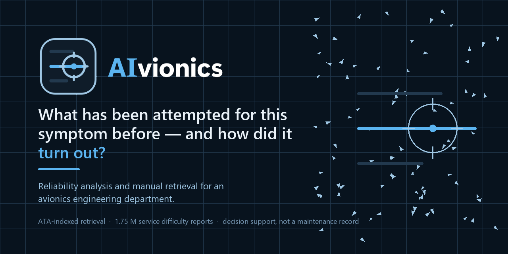
</p>

<p align="center">
  <strong>An intelligent avionics engineering workstation.</strong><br>
  Local-first. Indexes <em>into</em> controlled maintenance data without reproducing it.
</p>

<p align="center">
  
  
  
  
  
</p>

---

AIvionics helps an engineer investigate an aircraft defect: find what has been
attempted for this symptom before, see how it turned out, locate the applicable
ATA documentation, and check whether it even applies to the airframe in front of
them.

It answers one question:

> *"What has been attempted for this symptom before — and how did it turn out?"*

It is **decision support**. It is not part of the maintenance record, and it is
not an autonomous maintenance authority.

---

## Status — read this before the screenshots

This is an honest project, so the limitations come first.

| | |
|---|---|
| Retrieval quality gate (Gate 2) | **partly failed** — recall@50 is 0.333 against the 0.80 required |
| The cross-encoder reranker | **makes ranking worse** and is not shipped enabled |
| Confident-and-wrong rate | **0.922** — no engineer should see a ranked result until abstention is calibrated |
| Gold-set adjudication | **0 of 400 pairs done** — every retrieval number is agreement with a regex, not with an engineer |
| Confirmed maintenance outcomes | **0** — there is no learned root-cause capability and none is claimed |

What *did* pass: hybrid retrieval beats a stratified frequency baseline by
**5–6×** on NDCG@5, so the premise holds. And stage-1 recall is **0.784**
relaxed — the candidate generator usually finds the right task and the *ranker*
loses it. That is where the remaining headroom is.

**Structurally missing, and it caps what this can ever do:** no wiring manuals
(WDM/SWPM), so every retrieval path terminates at an LRU-level task — that is,
at a removal. No FIM/TSM procedure text. No shop findings, so true no-fault-found
does not exist in this data, only a repeat-defect proxy. And FAA SDR is a
*reportable-occurrence* sample, which systematically excludes the low-drama
removals where NFF concentrates.

---

## What it can do

### Diagnose — symptom to ranked locators

Free text in. Ranked task **locators** out — task number, title, manual,
revision, effectivity — alongside prior cases drawn from **1.75 M** FAA service
difficulty reports. Never procedure text.

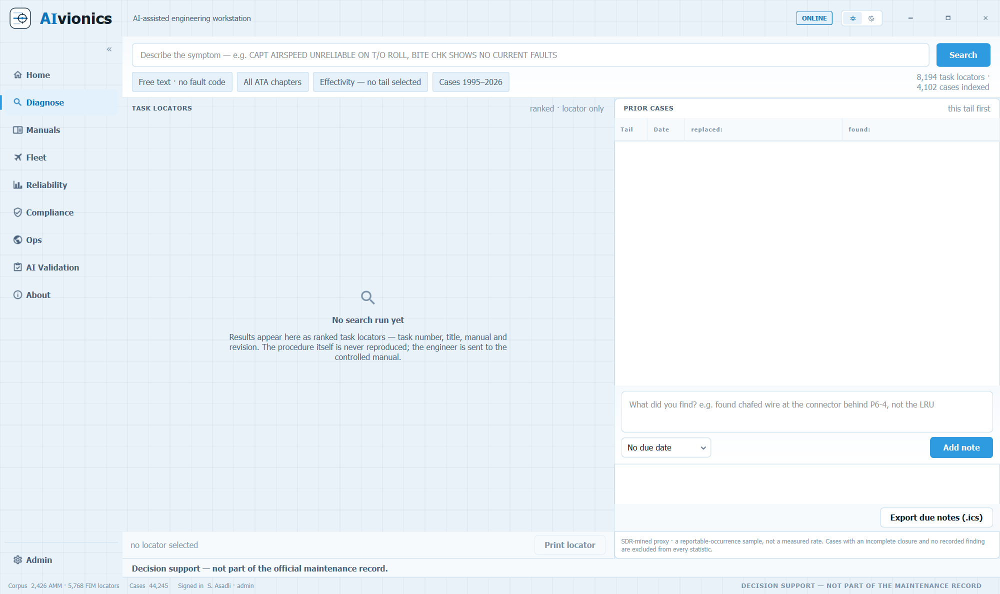

### Manuals — an ATA index, not a document dump

The full ATA chapter tree with per-chapter extraction coverage, revision
control, and an in-app PDF viewer with continuous scrolling and page printing.
Documents are classified, so a **type-training manual is labelled as one** and
never mistaken for approved maintenance data.

| ATA tree and coverage | Training-manual classification |
|---|---|
| 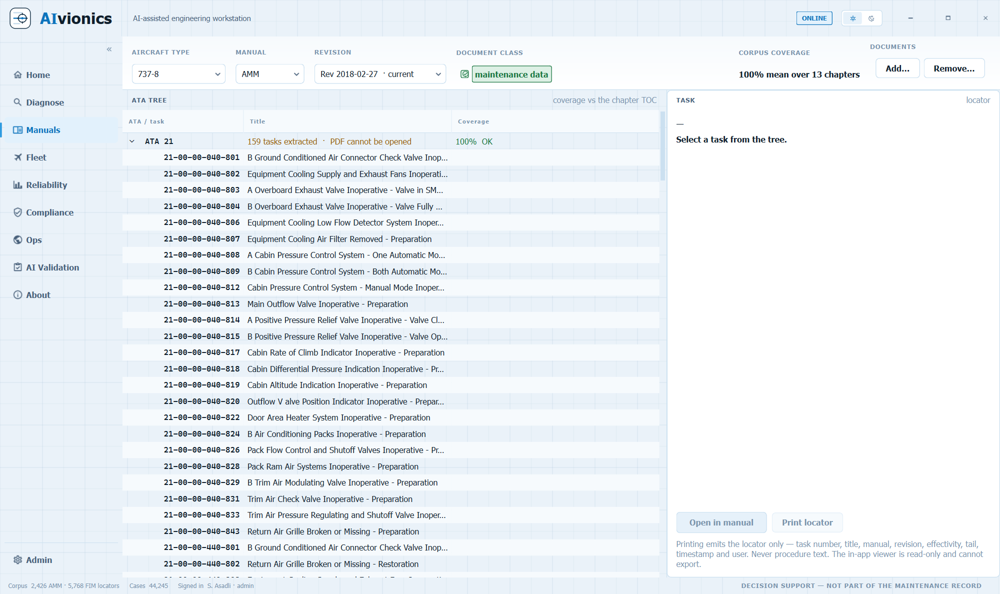 | 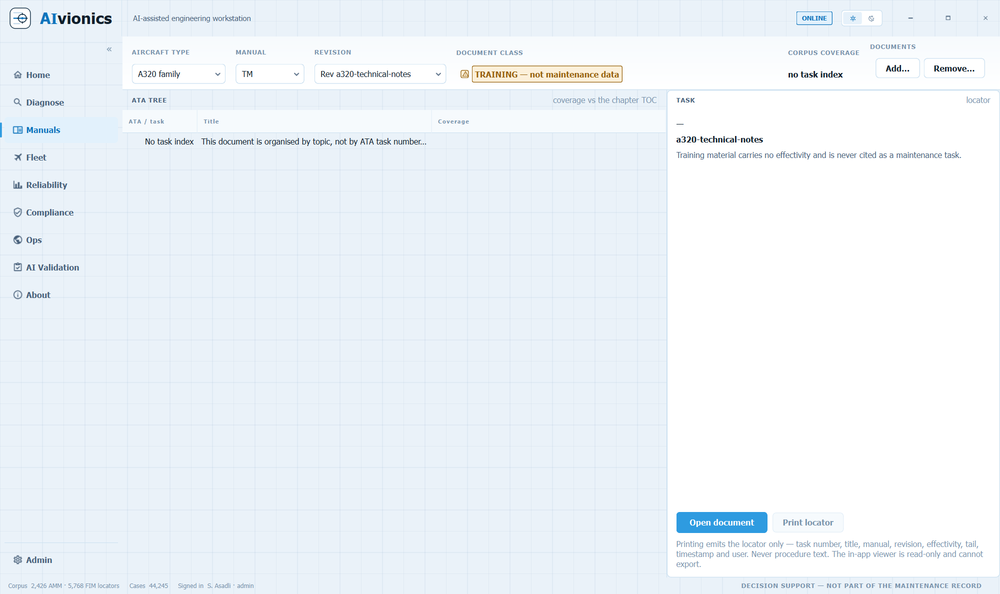 |

### Fleet, Reliability, Compliance

Per-tail defect history; repeat-defect proxy statistics; imported compliance
clocks — open checkups, MEL deferrals, AD/SB items — each carrying its
provenance and source system.

| Fleet | Reliability |
|---|---|
| 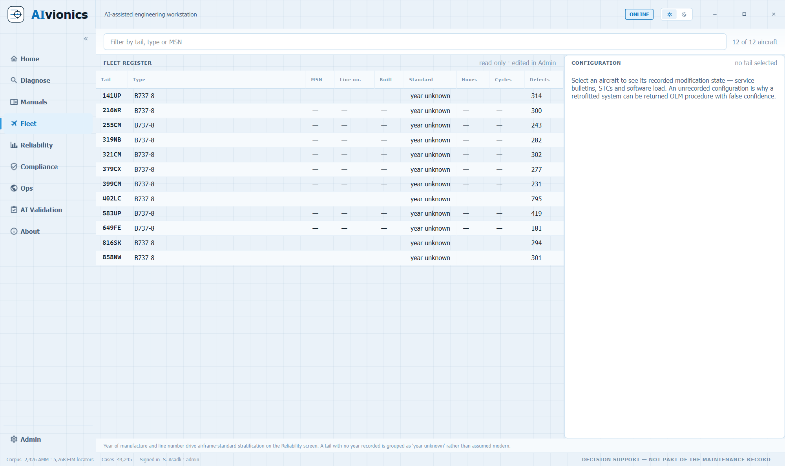 | 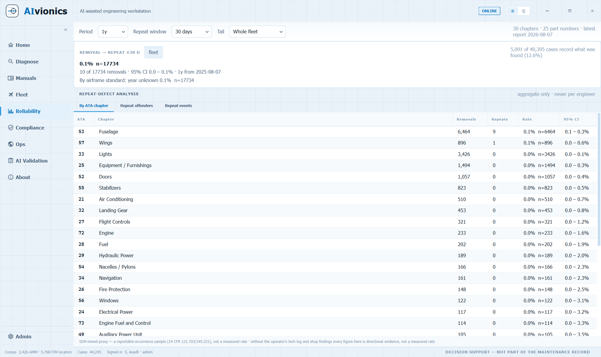 |

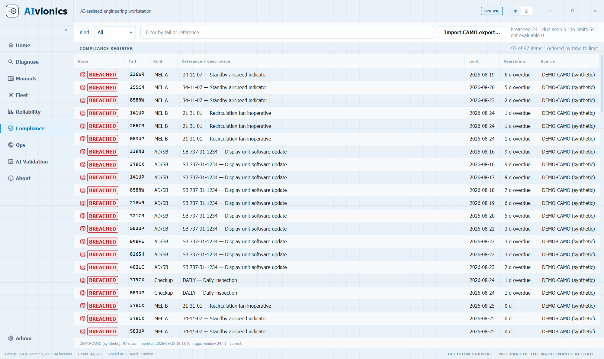

### Ops — live situational awareness

Pan-and-zoom fleet map with live ADS-B traffic from adsb.lol, a precipitation
radar composite, and an airport page carrying runways, frequencies, METAR/TAF
and photographs. Bundled airport data works offline; live layers are isolated
behind one auditable setting.

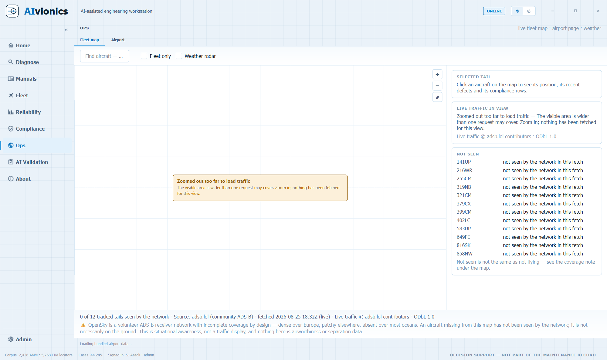

### AI Validation — the adjudication queue

A 400-case gold set with a full review lifecycle: draft and final states,
append-only revision history, a hash-chained audit trail, freezing, and a
professional 50-case overlap for inter-rater agreement.

| Dashboard | One case |
|---|---|
| 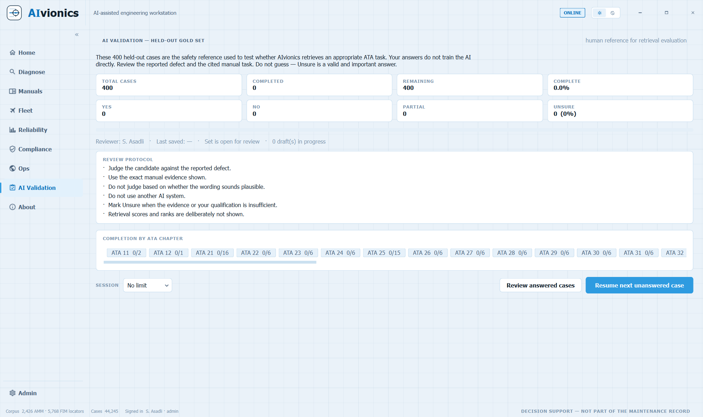 | 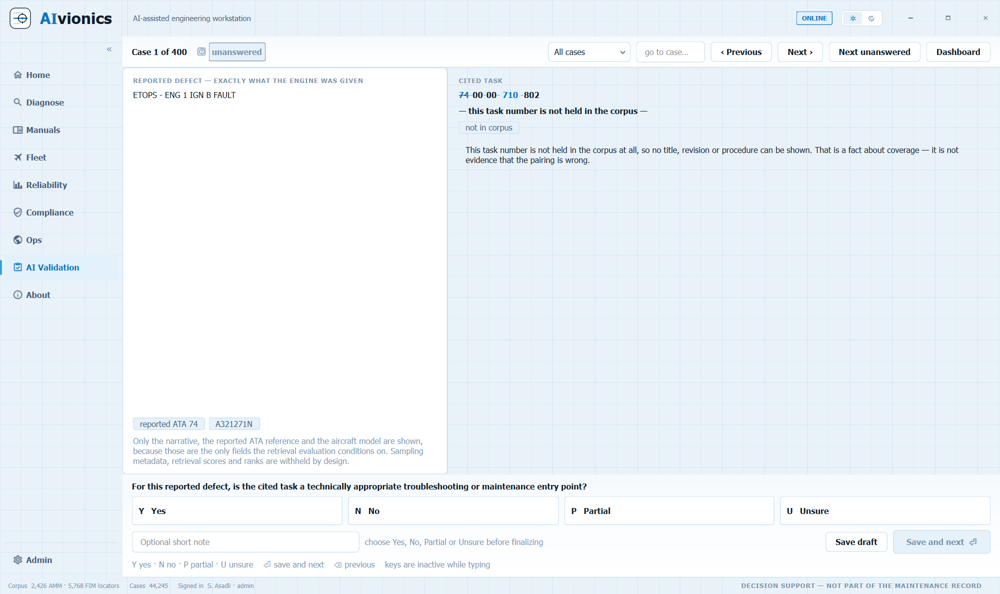 |

### And underneath

Login with two roles, a hash-chained audit log, notes anchored to a tail,
defect, task or case — never free-floating — and light and dark themes
throughout.

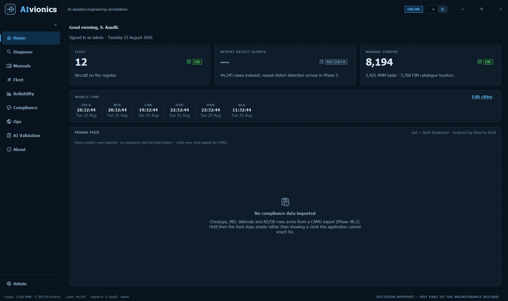

**Runs on a 16 GB office PC, installs per user, and works with the network
unplugged.** The manuals core, retrieval, case base and statistics are all local.

---

## How the AI works

### Which model is wired

| | |
|---|---|
| **Default model** | `nvidia/nemotron-3.5-lightning-30b-a3b` — *NVIDIA Nemotron 3.5 Lightning* |
| **Endpoint** | NVIDIA NIM, `https://integrate.api.nvidia.com/v1` (OpenAI-compatible) |
| **Alternative** | Any local Ollama model — defaults to `gemma3:4b` at `http://127.0.0.1:11434` |
| **Credential** | Windows Credential Manager, service `AIvionics/NVIDIA-NIM` |

The API key is **never** written to the database, to source, to configuration
files, to logs, to audit details or to error messages, and it is never
displayed again once saved.

### What Nemotron is asked to do

Full identifier: **`nvidia/nemotron-3.5-lightning-30b-a3b`**, served through
**NVIDIA NIM**. It has four missions, and each returns a strict JSON contract
that is validated before anything reaches the screen.

**1 · Extract the complaint.** Turn an engineer's free-text symptom into
structure: a normalised symptom, candidate ATA chapters, candidate systems,
fault codes, phase of flight, environmental factors — and, importantly, the
`missing_information` the engineer did not supply.

**2 · Propose cause candidates.** Ranked hypotheses (1–10), each carrying an
`evidence_level`, the case ids that **support** it and the case ids that
**contradict** it, plus its own limitations and provenance. Contradicting
evidence is a first-class field, not an afterthought.

**3 · Recommend documents.** Manual type, task number, title, revision,
effectivity result and authorization state — task **locators**, never task
bodies.

**4 · Abstain.** When the evidence supports no hypothesis, say so and give a
reason. An abstention is a correct answer, not a failure.

`evidence_level` is one of exactly four values — **strong**, **limited**,
**conflicting**, **insufficient**. It is a category. A model that writes "87%
confident" has broken the contract and is rejected, because a percentage
implies a calibration this system has not earned.

A fifth mission is deliberately disabled: `recommended_pages` must be returned
empty. **No page index exists, so no page may be cited** — rather than let the
model guess at page numbers that would look authoritative and be wrong.

### Retrieval is not the model

The ranking that matters happens before any model is called, and works without
one:

- **Lexical** — BM25 over SQLite FTS5, with column weights so an exact task-number
  hit outranks a title-word hit
- **Dense** — cosine over `BAAI/bge-small-en-v1.5` (384-dim), embedding the ATA
  hierarchy plus task title rather than the task body, following Jo (2025) —
  which sidesteps the truncation problem entirely
- **Adaptive fusion** — a query containing an exact token weights lexical
  `0.60` / dense `0.40`; free-text symptom prose flips to `0.15` / `0.85`,
  because SDR narratives are typo-dense by nature

A cross-encoder reranker (`ms-marco-MiniLM-L-12-v2`) was evaluated and
**rejected** — it halved every top-of-list metric. That finding is in the repo
rather than quietly dropped.

### The model reasons over evidence — it never supplies its own

The model is **not** asked *"which task applies?"* It is handed what retrieval
found and asked to reason over *those*.

This is not a stylistic preference. Asked where a pitot probe heater
fault-isolation task lives, Nemotron answered **ATA 31**. The corpus puts it at
`30-31-00-810-801`, in **ATA 30**. A model permitted to supply its own task
numbers will eventually supply that one — and it looks exactly like a correct
answer.

So the same rule is enforced twice: `ALLOWED TASK NUMBERS` in the prompt, and
`check_grounding` on the way back. One is a request; the other is a gate.

The system prompt binds ten rules. Among them:

> Every `task_number` you write must be copied character for character from
> ALLOWED TASK NUMBERS. A task number that is not in that list is a fabrication
> even if it looks correct, and it will be rejected.

> These are hypotheses, not causes. The case base records what an engineer
> **did**, never whether it was correct.

> If the evidence supports no hypothesis, set `abstained` to true. **An
> abstention is a correct answer.**

Also enforced: `evidence_level` is a category, never a percentage or confidence
score; no numeral may be stated that does not appear in the evidence; and
unresolved effectivity forces a fixed warning sentence into the output.

### Four structural guarantees

1. **A rejected answer is not a repaired answer.** When grounding fails, the
   `Investigation` carries the violations and `answer` stays `None` — there is
   no field a panel could render by accident.
2. **Model-unavailable is an ordinary state**, a value of `state` rather than an
   exception. The deterministic ranked-locator screen is complete without a
   model and stays that way.
3. **Every tool is read-only.** All **13** are declared `read`; no write tool
   exists. Permissions are read off the same `ROLES` table login uses, and an
   unknown role yields *nothing* rather than everything.
4. **Nothing runs on the UI thread.** Investigations use `QRunnable` + signals,
   and every stage checks a `CancelToken`, so a cancelled investigation stops
   between tool calls rather than after the model has finished thinking.

### What the model may read

Thirteen tools, all read-only: manual-task locator search, similar-case search,
case evidence, aircraft history, open defects, repeat defects, manual metadata,
effectivity check, page metadata, document authorization, compliance context,
and — isolated behind the online setting — live aircraft position and airport
movements.

`check_effectivity` **fails closed**: anything not positively applicable is
reported as unresolved.

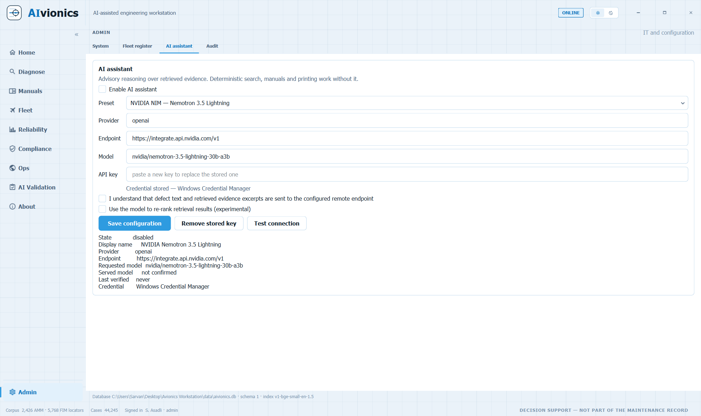

---

## The rules it holds itself to

Enforced in code and in tests, not just documented.

1. **Never render or print a task body outside the app.** Printing emits a
   locator only — task number, title, manual, revision, effectivity, tail,
   timestamp, user — and sends the engineer to the controlled source.
2. **Every numeral comes from the database**, never from generation. When there
   is no data the screen says so rather than showing a zero.
3. **Fail closed on effectivity.** Unresolved applicability renders
   *"applicability unresolved — verify in controlled data"*.
4. **Aggregate-only statistics.** No individual engineer attribution anywhere
   (BetrVG §87(1)(6), and because engineers who feel measured write vaguer
   narratives, which poisons the data).
5. **The LLM never touches procedural text.** Warnings and cautions render
   first, non-collapsible, outside any generated path.
6. **Online features are isolated behind one auditable setting**, with the
   outbound host list shown in Admin.

---

## Requirements

| | |
|---|---|
| **Python** | 3.11 or newer |
| **OS** | Windows 10/11 primarily. The application is Qt and runs elsewhere, but secure key storage resolves to Windows Credential Manager — on a machine with no secure keyring backend, AIvionics **refuses to persist an API key at all** rather than fall back to a file |
| **RAM** | 16 GB recommended. It is built to run on an ordinary office PC |
| **GPU** | None. Embeddings run on CPU through ONNX |
| **Network** | Optional. The manuals core, retrieval, case base and statistics are fully local |

Everything installs from `pip install -e .`:

| Package | For |
|---|---|
| `PySide6`, `QtAwesome`, `pyqtgraph` | UI, icons, charts |
| `pymupdf` | The in-app PDF viewer |
| `fastembed`, `numpy`, `sqlite-vec` | Embeddings and vector search |
| `flashrank` | The cross-encoder reranker — evaluated, **not enabled** |
| `bcrypt` | Password hashing, cost 12 |
| `keyring` | API-key storage in Windows Credential Manager |
| `timezonefinder` | Offline IANA zone from lat/lon |

An LLM is **optional**. Without one, the deterministic ranked-locator screen is
complete and the application is fully usable.

---

## Try it

```bash
pip install -e .
python -m aivionics.ui
```

Or double-click **`Start AIvionics.bat`**.

### Signing in — there is no default password

**AIvionics ships with no default password, and no shared setup secret.** A new
database seeds a single `admin` account whose password is
`secrets.token_urlsafe(48)` — a random value nobody, including the author,
knows.

On first run you **claim** that account: the application recognises the
unclaimed local `admin`, asks you to set a password, and issues a **one-time
recovery code** — four groups of five characters, drawn from an alphabet with
no `I`, `O`, `0` or `1`, because it is meant to be written on paper and read
back. **Save it.** It is the only way back into an account whose password is
lost.

Passwords must be at least 10 characters. Any later reset uses the recovery
code — the first-run claim path is narrow by design and cannot become an
authentication bypass for ordinary accounts.

### Two roles

| Role | Permissions |
|---|---|
| `admin` | users, roles, ingest, models, settings, audit, read, print |
| `engineer` | read, print, notes |

The same `ROLES` table governs what the **model** may call. An unknown role
yields no permissions rather than all of them.

The application ships with no corpus. To see it populated, build the demo
database — it registers twelve **real** aircraft tails that already carry
reported defects in the public FAA SDR data:

```bash
python scripts/make_demo_db.py
python -m aivionics.ui --db data/demo/aivionics-demo.db
```

Nothing in the demo dataset is fabricated. Registration details a fleet register
would normally hold — MSN, line number, hours, cycles — are left blank, because
SDR does not publish them and inventing them would undermine the point.

```bash
python -m pytest -q                     # 902 passing
python scripts/github_screenshots.py    # regenerate docs/screenshots/
```

`github_screenshots.py` refuses to shoot a rendered manual page.

To wire the model: **Admin → AI assistant**, paste an NVIDIA NIM key. It goes to
Windows Credential Manager, never to the database.

---

## About

AIvionics is a local-first intelligent avionics engineering workstation designed
to help engineers investigate aircraft defects, identify probable causes, locate
applicable ATA documentation, review relevant maintenance procedures and prepare
approved pages for technicians.

The platform brings engineering diagnostics, maintenance documentation,
historical defect information, fleet awareness, live aircraft tracking, airport
information, weather and operational data into one unified environment.

AIvionics is designed as an engineering decision-support system. It helps
engineers retrieve, organize and evaluate evidence while keeping qualified
personnel in control of every maintenance decision.

### What it replaces having open at once

| |
|---|
| Aircraft defect reports |
| Historical maintenance cases |
| ATA documentation |
| AMM, FIM/TSM, WDM, IPC, SRM, CMM and MEL documents |
| Fleet and aircraft information |
| Airport and flight information |
| Weather and operational data |
| Separate diagnostic and reporting tools |

### Not limited to one aircraft type

AIvionics is designed to support multiple manufacturers, aircraft families,
models and variants through separate aircraft-specific knowledge packages.

Each knowledge package can contain applicable manuals, revisions, effectivity
information and historical cases. AIvionics filters its evidence according to
the selected aircraft and **must not use documentation from an incompatible
aircraft type.**

### The workflow

| Step | |
|---|---|
| 1 | Aircraft and defect information |
| 2 | Aircraft-effectivity filtering |
| 3 | Historical-case retrieval |
| 4 | Applicable ATA and manual retrieval |
| 5 | AI-assisted analysis |
| 6 | Probable causes and confidence |
| 7 | Exact document, task and page references |
| 8 | Engineer review and feedback |

AIvionics does not replace maintenance manuals. It helps find and organize
relevant evidence from approved sources.

### Safety and responsibility

> **AIvionics is an engineering decision-support system. It does not replace
> approved aircraft maintenance documentation, organizational procedures,
> licensed personnel or regulatory requirements. All recommendations must be
> independently verified before maintenance action.**

- Probable causes are advisory recommendations, not confirmed diagnoses.
- AI-generated information must be supported by traceable evidence.
- Missing or insufficient evidence must be clearly disclosed.
- Manual applicability and aircraft effectivity must be verified.
- Only approved documents and pages may be released or printed for technicians.
- Final maintenance decisions remain the responsibility of authorized personnel.

### Connectivity

- Core manual access and previously indexed engineering information can work
  locally.
- Some operational features require an internet connection.
- Live aircraft tracking, current airport data, weather, imagery and other
  external information depend on their respective online data providers.
- Online status does not change the authority or applicability of approved
  maintenance documents.

### Creator

**AIvionics was conceived, created and directed by Sarvan Asadli.**

> **Sarvan Asadli**
> M.Sc. Electrical Engineering & Information Technology
> Avionics Engineer (B.Sc. Honours)
> AI & LLM Systems
> RDMA, GPU-to-GPU & FPGA Research

### AI systems used during development

These models and platforms assisted in building AIvionics:

| System |
|---|
| **Kimi K3** |
| **Claude Fable 5** |
| **Claude Opus 5** |
| **DeepSeek V4 Pro** |
| **OpenAI Codex** |
| **NVIDIA Nemotron** — `nvidia/nemotron-3.5-lightning-30b-a3b` |
| **NVIDIA NIM** — inference platform, `https://integrate.api.nvidia.com/v1` |

NVIDIA Nemotron is the only one of these that is *wired into the product*; it
runs at inference time through NVIDIA NIM. The rest assisted during
development only and are not called by the application.

AIvionics is an independently created product. The use of these AI systems does
not imply sponsorship, certification or endorsement by their developers or
associated companies.

---

## Data and licences

Every bundled asset has a row in [`assets/LICENSES.md`](assets/LICENSES.md).
Nothing ships without one.

The source is MIT ([`LICENSE`](LICENSE)). [`NOTICE.md`](NOTICE.md) states what
that does **not** grant: no right to aircraft maintenance data, and no
affiliation with any manufacturer named in the software.

| Source | Used for | Licence |
|---|---|---|
| [OurAirports](https://github.com/davidmegginson/ourairports-data) | 85,836 airports, runways, frequencies, navaids — bundled | Public domain |
| FAA SDR | 1.75 M service difficulty reports | US Government, public |
| [adsb.lol](https://adsb.lol) | Live ADS-B traffic | ODbL 1.0 |
| RainViewer | Precipitation radar composite | Free, non-commercial, attribution |
| Wikimedia Commons | Airport and aircraft photographs | CC BY / CC BY-SA, per-file credit |
| [timezonefinder](https://github.com/jannikmi/timezonefinder) | IANA zone from lat/lon, offline | MIT |
| [flag-icons](https://github.com/lipis/flag-icons) | 271 country flags | MIT |

**No maintenance manual is included in this repository, and none may be
redistributed with it.** Manuals are licensed to each operator separately and
are read from the path in `AIVIONICS_CORPUS`.
